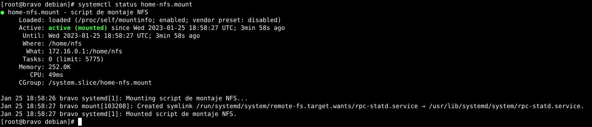
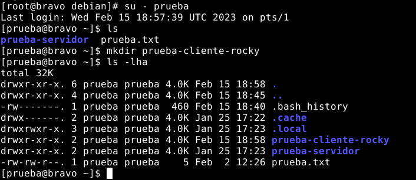

# OpenLDAP 3.
## LDAPs.

Configura el servidor LDAP de alfa para que utilice el protocolo ldaps:// a la vez que el ldap:// utilizando el certificado x509 de la práctica de https o solicitando el correspondiente a través de gestiona. Realiza las modificaciones adecuadas en los clientes ldap de alfa para que todas las consultas se realicen por defecto utilizando ldaps://

---------------------------------------------------------------------------------------------------------------------------------------------

### Obtención de los Certificados.

Para esta práctica, se hará uso de SSL/TLS para cifrar las conversaciones entre el servidor LDAP instalado en Alfa y sus clientes. Para lograrlo, se empleará la herramienta openssl que nos proporciona los certificados x509 necesarios para cifrar las comunicaciones. 

Para ello, generaremos una solicitud de firma de certificado (Certificate Signing Request o CSR).

- Creamos una clave privada RSA de 4096 bits (Como root):
```bash
openssl genrsa 4096 > /etc/ssl/private/alfa.key
```

- Creamos un fichero csr para que sea firmado por la CA Gonzalo Nazareno, para lo que tendremos que poner los mismos campos que tiene la entidad:
```bash
openssl req -new -key /etc/ssl/private/alfa.key -out /root/alfa.csr
```

- Nos pedirá una serie de valores para identificar al certificado, que tendremos que rellenar correctamente y son:
```bash
      C=ES
      ST=Sevilla
      L=Dos Hermanas
      O=IES Gonzalo Nazareno
      OU=Informatica
      CN=alfa.ivan.gonzalonazareno.org
```

Hacemos llegar el csr a la entidad certificadora.

Una vez ya tengamos los dos certificados, los pasamos a Alfa.

Tenemos, de esta forma, los siguientes ficheros en alfa:
```bash
ls -l
```


Una vez llevados los ficheros a Alfa, debemos añadirlos a sus correspondientes directorios para tener una mayor organización y un mayor control sobre ellos:
```bash
mv gonzalonazareno.crt /etc/ssl/certs/
mv alfa.crt /etc/ssl/certs/
```

Tenemos que asegurarnos de que el propietario de dichos ficheros sea root y los permisos que tengan no hayan cambiado durante la transferencia:
```bash
ls -l /etc/ssl/certs | egrep 'gonzalo|alfa'

ls -l /etc/ssl/private
```


Para que el usuario ldap pueda hacer uso de la key, deberemos crear unas acls que permitan únicamente al usuario ‘openldap’ tener acceso a dichos ficheros. Así que para esto, ejecutamos:
```bash
setfacl -m u:openldap:r-x /etc/ssl/private
setfacl -m u:openldap:r-x /etc/ssl/private/alfa.key
```


Podemos visualizar las acls de la siguiente forma:
```bash
getfacl /etc/ssl/private

getfacl /etc/ssl/private/alfa.key 
```


### Configuración de LDAP

Ahora podemos prepararnos para emplear SSL/TLS en ldap, sin necesidad de tocar ningún archivo de configuración del sistema, como sucedería con otros servicios. LDAP, para evitar tener que reiniciar el servicio cuando se hace algún cambio, incorporó la configuración como una entrada más en el árbol de directorios. Por lo tanto, debemos cargar los cambios a un archivo .ldif y subirlo al servidor.
```bash
nano ldaps_config.ldif 
```
```ldif
dn: cn=config
changetype: modify
replace: olcTLSCACertificateFile
olcTLSCACertificateFile: /etc/ssl/certs/gonzalonazareno.crt
-
replace: olcTLSCertificateKeyFile
olcTLSCertificateKeyFile: /etc/ssl/private/alfa.key
-
replace: olcTLSCertificateFile
olcTLSCertificateFile: /etc/ssl/certs/alfa.crt
```

Ahora para incorporar esta configuración usamos el siguiente comando:
```bash
ldapmodify -Y EXTERNAL -H ldapi:/// -f ldaps_config.ldif 
```


Para que ldap haga uso del puerto 636 (el puerto designado para ldaps), se debe modificar el archivo /etc/default/slapd y agregar el siguiente contenido:
```bash
nano /etc/default/slapd

SLAPD_SERVICES="ldap:/// ldapi:/// ldaps:///"
```


Como hemos cambiado la configuración, tenemos que reiniciar el servicio:
```bash
systemctl restart slapd
```

Podemos comprobar que ya se encuentra escuchando por el puerto 636 mediante el siguiente comando:
```bash
netstat -tlnp | egrep slap
```


Ahora que nuestro servidor está preparado para aceptar solicitudes a través del puerto, hay que configurar los clientes para que usen LDAPS como el método predeterminado para las consultas. Esto se logra haciendo uso del paquete "ca-certificates", el cual se instala de forma predeterminada y se encarga de administrar y actualizar la lista de autoridades certificadoras. Esto lo hace mediante el certificado de Gonzalo Nazareno importado previamente.

Vamos a copiar el certificado en el directorio /usr/local/share/ca-certificates/, que es el directorio pensado para poner los certificados que instalemos localmente:
```bash
cp /etc/ssl/certs/gonzalonazareno.crt /usr/local/share/ca-certificates/
```

Ahora tenemos que actualizar la lista de certificados:
```bash
update-ca-certificates
```

Este último paso lo he realizado en el servidor y en los clientes, para poder usar ldaps como cliente en todos.

Con esto ya podemos ejecutar peticiones al servidor ldap usando SSL/TLS. Para probarlo, haremos primero una consulta especificando el uso de LDAPs en el propio servidor:
```bash
ldapsearch -x -b "dc=ivan,dc=gonzalonazareno,dc=org" -H ldaps://localhost:636
```


Acto seguido lo haremos desde uno de los clientes(Ubuntu):
```bash
ldapsearch -x -b "dc=ivan,dc=gonzalonazareno,dc=org" -H ldaps://alfa.ivan.gonzalonazareno.org:636
```


Como vemos, ha funcionado. 

Ahora, en Alfa, si queremos que use ldaps, pero no ldap, haremos lo siguiente:
```bash
nano /etc/default/slapd

SLAPD_SERVICES="ldapi:/// ldaps:///"
```
```bash
systemctl restart slapd
```

Tras esto, si tratamos desde el cliente hacer una consulta usando ldap, obtendremos el siguiente error:
```bash
ldapsearch -x -b "dc=ivan,dc=gonzalonazareno,dc=org"
```


Para hacer que el cliente use por defecto ldaps en lugar de ldap para realizar las conexiones, tenemos que volver a modificar el fichero de configuración del cliente, y añadir o modificar la siguiente línea (tanto en cliente Ubuntu como Rocky):
```bash
nano /etc/ldap/ldap.conf

BASE dc=ivan,dc=gonzalonazareno,dc=org
URI ldaps://alfa.ivan.gonzalonazareno.org
```

Ahora podemos realizar una búsqueda normal, que usará por defecto ldaps, y solo podrá acceder al servidor usando el puerto 636:
```bash
ldapsearch -x -b "dc=ivan,dc=gonzalonazareno,dc=org"
```


En mi caso he decidido utilizar ldap y ldaps.

### Configuración del Cliente Ubuntu

En el apartado anterior hemos visto como configurar el servidor para que use SSL/TLS. Ahora vamos a ver comprobar que el inicio de sesión funciona correctamente en el cliente Ubuntu.

Lo único que vamos a tener que hacer en el cliente como ya expliqué antes es copiar el certificado en el directorio /usr/local/share/ca-certificates/, en este caso haríamos lo siguiente:
```bash
cp gonzalonazareno.crt /usr/local/share/ca-certificates/
```

Ahora tenemos que actualizar la lista de certificados:
```bash
update-ca-certificates
```

Antes cuando expliqué que podíamos configurar el servidor y el cliente para el uso estricto o no estricto de ldaps, ya comprobamos que la busqueda funciona correctamente, así que ahora vamos a ver si el inicio de sesión funciona correctamente.

Dijimos que teníamos que configurar este archivo en el cliente:
```bash
nano /etc/ldap/ldap.conf

BASE dc=ivan,dc=gonzalonazareno,dc=org
URI ldaps://alfa.ivan.gonzalonazareno.org
```

Pero esto no servirá para hacer que el cliente use ldaps al loguearse, ya que el cliente no tiene configurado el inicio de sesión. Para ello, deberemos modificar el archivo:
```bash
nano /etc/ldap.conf

BASE dc=ivan,dc=gonzalonazareno,dc=org
URI ldaps://alfa.ivan.gonzalonazareno.org
```

Una vez hecho esto, nuestro cliente ya está preparado para usar ldaps al iniciar sesión.

Como esas comprobaciones anteriormente las hicimos en el client Delta, ahora lo vamos a hacer en el cliente Charlie(Ubuntu también).

Para configurar este cliente seguiremos los procesos ya explicados en la primera práctica.

Para hacer más interesante este apartado, he decidido modificar la configuración PAM de este cliente, para que al iniciar sesión desde el cliente, se cree automaticante su home. Para ello, vamos a modificar el archivo /etc/pam.d/common-session, y vamos a añadir la siguiente línea:
```bash
session required pam_mkhomedir.so skel=/etc/skel umask=077
```

Para comprobar esto, vamos a crear un usuario nuevo en el servidor (prueba2), y vamos a intentar iniciar sesión en el cliente con ese usuario.
```bash
login prueba2
```


Como podemos ver, nos ha creado el directorio home del usuario prueba2.

Vamos a dejar marca de que ha funcionado, creando un directorio en el home del usuario prueba2:


Vamos a salir de la sesión, y vamos a comprobar que el directorio se ha creado correctamente:


¿Y desde el servidor Alfa podremos ver estos cambios efectuados? ¡Claro que sí! Vamos a comprobarlo:


Hasta aquí la configuración del cliente Ubuntu.

### Configuración del Cliente RockyLinux

Para configurar el cliente Rocky, primero debemos instalar el paquete de herramientas de ldap:
```bash
dnf install openldap-clients
```

Luego, editamos el archivo de configuración de PAM (Pluggable Authentication Modules). El archivo de configuración de PAM se llama /etc/pam.d/common-auth y debe contener la siguiente línea: 
```bash
auth sufficient pam_ldap.so 
```

Ahora, vamos a crear un fichero de configuración para el cliente:
```bash
nano /etc/openldap/ldap.conf
```
```bash
BASE dc=ivan,dc=gonzalonazareno,dc=org
URI ldaps://alfa.ivan.gonzalonazareno.org
```

Finalmente, para permitir que el usuario prueba acceda al home del usuario prueba, deberemos editar el archivo de configuración de PAM para permitir la autenticación de usuarios LDAP. El archivo de configuración de PAM se llama /etc/pam.d/common-session y debe contener la siguiente línea: 
```bash
session sufficient pam_mkhomedir.so umask=0022 skel=/etc/skel/
```

Una vez que ya tenemos el fichero de configuración, podemos comprobar que funciona correctamente:
```bash
ldapsearch -x -b "dc=ivan,dc=gonzalonazareno,dc=org"
```


Como podemos ver, funciona correctamente.

Ahora vamos a comprobar que funciona correctamente desde el cliente Rocky. Para ello, usaremos el siguiente comando para conectarnos al servidor LDAP con el usuario prueba y verificar la autentificación:
```bash
ldapwhoami -x -D "uid=prueba,ou=Personas,dc=ivan,dc=gonzalonazareno,dc=org" -W
```


Como podemos ver, funciona correctamente.

Instalamos los paquetes necesarios para realizar el login con LDAP:
```bash
dnf -y install openldap-clients sssd sssd-ldap oddjob-mkhomedir 

authselect select sssd with-mkhomedir --force
```

La opción mkhomedir crea el directorio home del usuario en el momento en que se inicia sesión. La opción with-mkhomedir es una opción de authselect que se usa para habilitar la opción mkhomedir.

Añadimos las siguientes líneas en el archivo de configuración de SSSD (/etc/sssd/sssd.conf):
```bash
[domain/default]
id_provider = ldap
autofs_provider = ldap
auth_provider = ldap
chpass_provider = ldap
ldap_uri = ldaps://alfa.ivan.gonzalonazareno.org
ldap_search_base = dc=ivan,dc=gonzalonazareno,dc=org
ldap_id_use_start_tls = True
ldap_tls_cacertdir = /etc/openldap/cacerts
cache_credentials = True
ldap_tls_reqcert = allow

[sssd]
services = nss, pam, autofs
domains = default

[nss]
homedir_substring = /home/nfs
```

Acto seguido, copiaremos el certificado en el directorio /etc/openldap/cacerts, en este caso haríamos lo siguiente:
```bash
cp gonzalonazareno.crt /etc/openldap/cacerts
```

Ahora, reiniciamos los servicios y los habilitamos:
```bash
chmod 600 /etc/sssd/sssd.conf 
systemctl restart sssd
systemctl enable sssd
```

Ahora configuramos el cliente para conectarse al servidor NFS (Ya trabajamos con NFS en esta máquina en una pŕactica anterior así que me he tomado la libertad de saltarme numerosos pasos). Primero crearíamos el directorio de montaje, pero como vamos a utilizar mkhomedir, no es necesario crearlo ya que se creará automáticamente.

Montamos el directorio de inicio del usuario prueba:
```bash
nano /etc/systemd/system/home-nfs.mount
```
```bash
[Unit]
Description=script de montaje NFS
Requires=NetworkManager.service
After=NetworkManager.service
[Mount]
What=172.16.0.1:/home/nfs
Where=/home/nfs
Options=_netdev,auto
Type=nfs
[Install]
WantedBy=multi-user.target
```

Reiniamos el servicio:
```bash
systemctl daemon-reload
systemctl start mnt-nfs.mount
```



Ahora vamos a comprobar que funciona correctamente al loguearnos con el usuario prueba:



Vamos a comprobar que ha funcionado bien desde el servidor Alfa:


Ahora en Rocky vamos a iniciar sesión con el usuario prueba2:


Y vamos a comprobar que ha funcionado correctamente desde el servidor Alfa:


Hasta aquí la configuración del cliente Rocky.

### Configurar el Servidor para que los usuarios puedan iniciar sesión sin ser root

En la primera practica de LDAP, no configuré el servidor NFS(Alfa) para que brindara el servicio de inicio de sesión sin ser root. Para ello, debemos editar el archivo de configuración de NFS:
```bash
/etc/exports

/home/nfs              *(rw,fsid=0,subtree_check,no_root_squash)
```

Ahora, reiniciamos el servicio:
```bash
systemctl restart nfs-kernel-server
exportfs
```

Ahora, vamos a comprobar que funciona correctamente. Para ello, me loguaré con el usuario prueba2 desde el cliente Rocky, y los dos clientes Ubuntu:

- Cliente Rocky:

   

- Cliente Ubuntu (Charlie):
  
   

- Cliente Ubuntu (Delta):

   

Como podemos ver, funciona correctamente.
